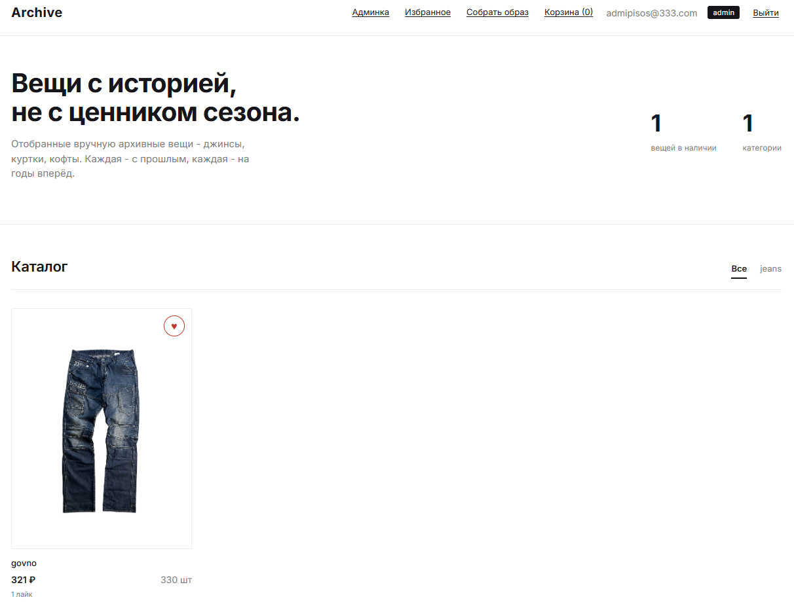

# Forma - secondhand clothing shop

Full-stack e-commerce платформа для продажи винтажной/секонд-хенд одежды. Учебный pet-проект, сделан с нуля для портфолио.



## Стек

**Backend:** Python, FastAPI, SQLAlchemy, MySQL, Docker
**Frontend:** vanilla HTML/CSS/JS (без фреймворка)
**Тесты:** pytest

## Ключевые фичи

- **JWT-аутентификация** с bcrypt-хешированием паролей, account lockout после 5 неудачных попыток входа, rate limiting на login/register
- **RBAC** - роли user/admin, полноценная админ-панель
- **Race condition защита** на списание товара со склада (`SELECT FOR UPDATE`), протестирована конкурентными потоками против реальной MySQL
- **Промокоды и скидки** - процентные/фиксированные, по товару/категории/всему заказу, с проверкой лимита использований и защитой от гонки при одновременном применении
- **Заказы с ручным подтверждением** - наличие товара списывается только после того как админ подтвердит выполнение заказа, а не в момент оформления
- **Галерея фото товаров**, лайки/избранное, конструктор образов (drag & drop, resize, слои)
- **Оформление через Telegram** - заказ формирует текст со списком товаров, который отправляется менеджеру вручную (без интеграции платежей)
- Security hardening: CORS, security headers, TrustedHost, лимит размера запроса, скрытие Swagger в проде

## Как запустить локально

```bash
cd archive
docker compose up --build
```

Бэкенд поднимется на `http://localhost:8000`, Swagger - на `/docs`.

Фронтенд (отдельно, статика):
```bash
cd archive/frontend
python -m http.server 5173
```

Открыть `http://localhost:5173`.

## Тесты

```bash
docker compose exec app python -m pytest tests/ -v
```
